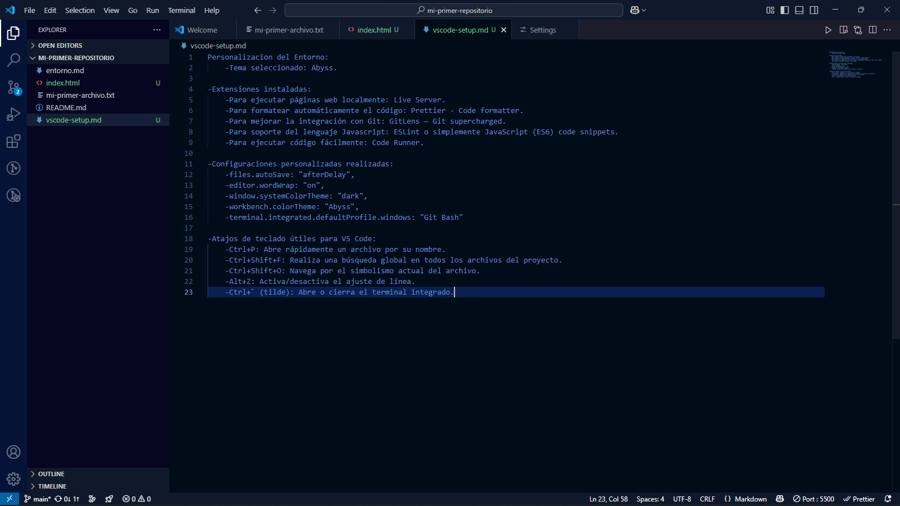

Personalizacion del Entorno:
    -Tema seleccionado: Abyss.

-Extensiones instaladas:
    -Para ejecutar páginas web localmente: Live Server.
    -Para formatear automáticamente el código: Prettier - Code formatter.
    -Para mejorar la integración con Git: GitLens — Git supercharged.
    -Para soporte del lenguaje Javascript: ESLint o simplemente JavaScript (ES6) code snippets.
    -Para ejecutar código fácilmente: Code Runner.

-Configuraciones personalizadas realizadas:
    -files.autoSave: "afterDelay",
    -editor.wordWrap: "on",
    -window.systemColorTheme: "dark",
    -workbench.colorTheme: "Abyss",
    -terminal.integrated.defaultProfile.windows: "Git Bash"

-Atajos de teclado útiles para VS Code:
    -Ctrl+P: Abre rápidamente un archivo por su nombre.
    -Ctrl+Shift+F: Realiza una búsqueda global en todos los archivos del proyecto.
    -Ctrl+Shift+O: Navega por el simbolismo actual del archivo.
    -Alt+Z: Activa/Desactiva el ajuste de línea.
    -Ctrl+` (tilde): Abre o cierra el terminal integrado.

